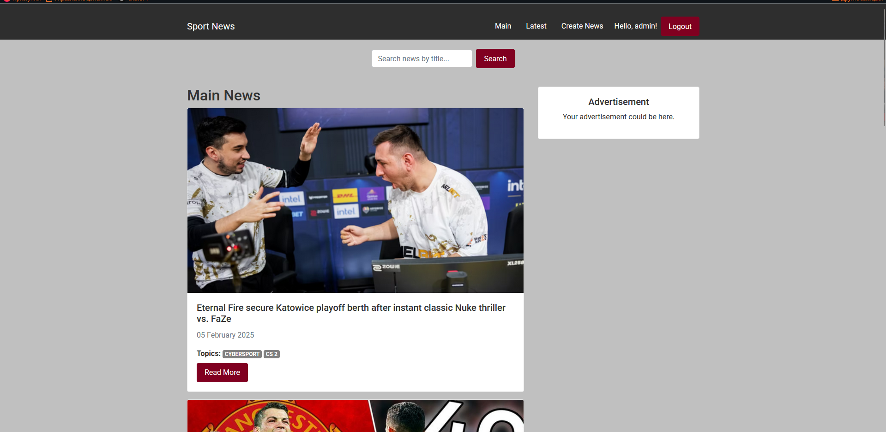
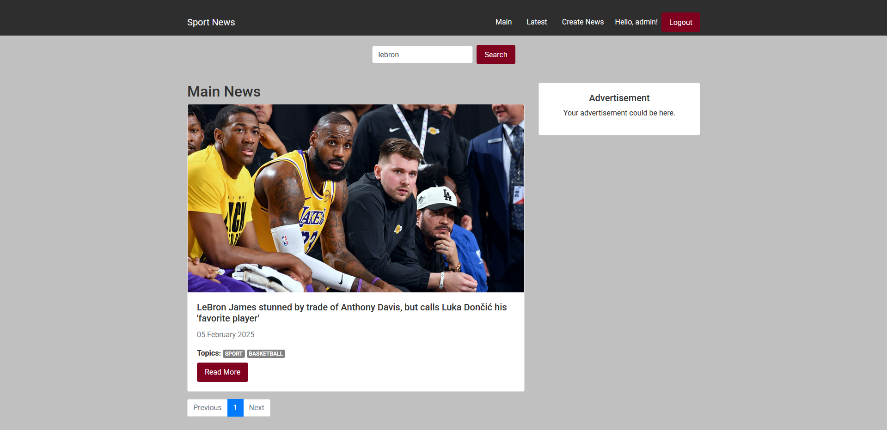
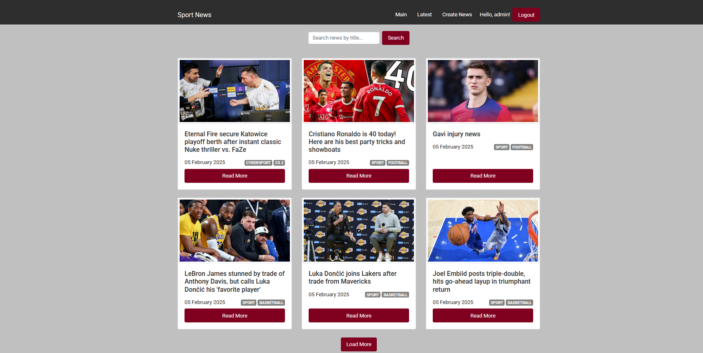
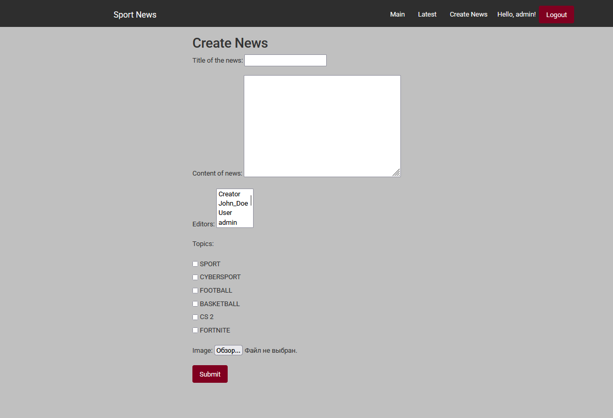
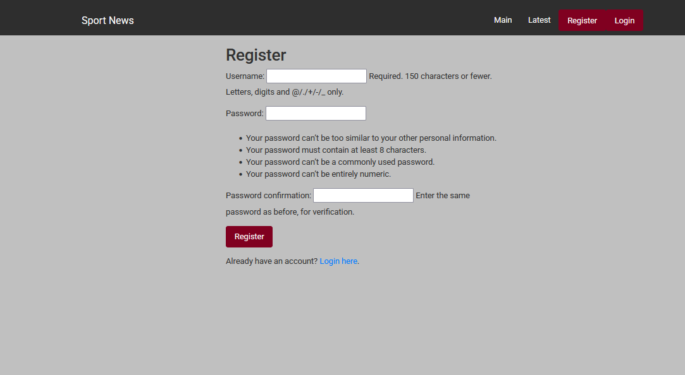
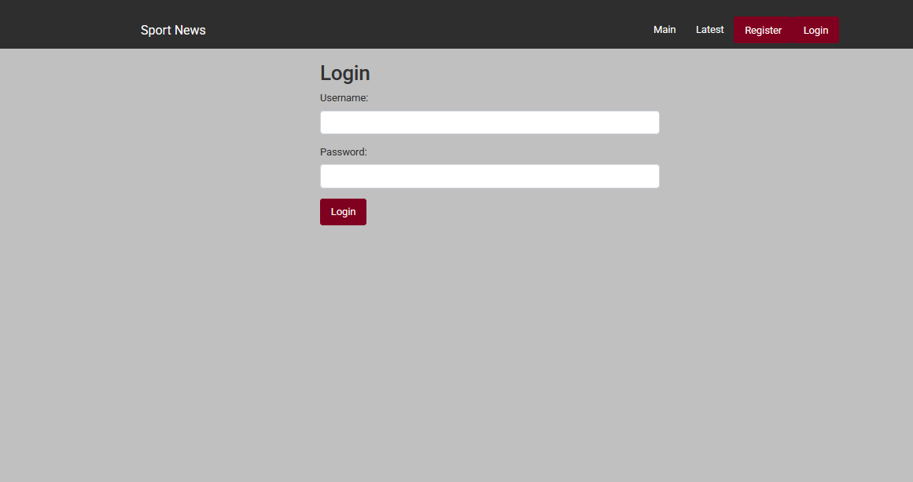

# Sports News Project

## Description

1. When you visit the site, you have the option to either register or log in. Once logged in, you will be able to view news and interact with them.
2. When you click on the **Create News** button, if you do not have the permissions to create news, you will be redirected to the login page to verify that you have the necessary rights.
3. The site includes various genres to help you understand the type of news you are viewing, and it also features a search functionality for news or specific segments of news.
4. A database is used to store all information regarding user activities.
5.  If you need access to creating news. Create super-user:
    python manage.py createsuperuser
*In the image, you can see what the fully populated site looks like.*

    

